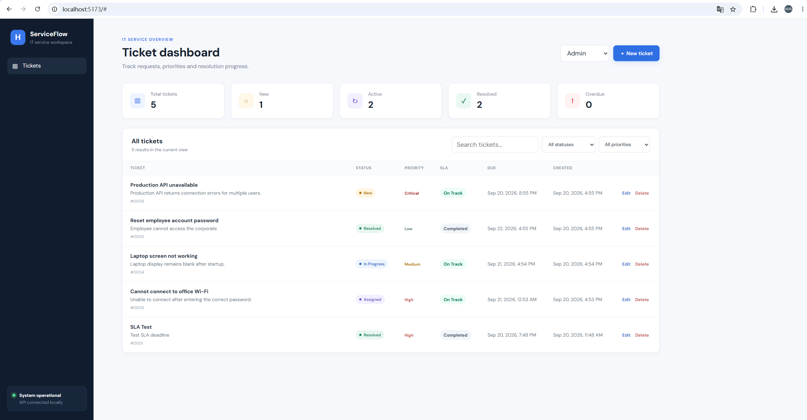
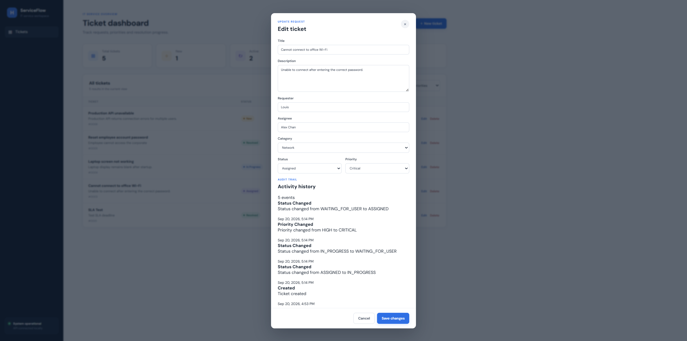

# ServiceFlow – IT Service Request & Issue Management System

ServiceFlow is a portfolio IT service management project that extends an open-source helpdesk baseline into a structured workflow for internal IT support.

The project focuses on requirements-driven enhancement: ticket lifecycle design, ownership and assignment rules, auditability, SLA monitoring, search/dashboard visibility, role-based access control, API validation, and automated testing.

## Key Features

- Six lifecycle states: `NEW`, `ASSIGNED`, `IN_PROGRESS`, `WAITING_FOR_USER`, `RESOLVED`, `CLOSED`
- Priorities: `LOW`, `MEDIUM`, `HIGH`, `CRITICAL`
- Categories: `HARDWARE`, `SOFTWARE`, `NETWORK`, `ACCOUNT`, `ACCESS_REQUEST`, `OTHER`
- Requester and assignee ownership
- Backend assignment rule: `ASSIGNED` requires an assignee
- Audit trail for creation and changes to status, assignee, and priority
- Priority-based SLA deadlines and `ON_TRACK` / `OVERDUE` / `COMPLETED` status
- Dashboard metrics for total, new, active, resolved, and overdue tickets
- Status/priority filters and instant keyword search
- Role-based access control demo for Employee, IT Support, and Admin
- Structured validation and global API error handling
- Unit and integration tests for workflow and business rules

## Business Context

Internal IT teams need a consistent way to receive, classify, assign, track, and resolve service requests. ServiceFlow adds ownership, traceability, service targets, permissions, and operational visibility to a basic helpdesk workflow.

## Ticket Workflow

```text
NEW
ASSIGNED
IN_PROGRESS
WAITING_FOR_USER
RESOLVED
CLOSED
```

These states represent the supported ticket lifecycle. The backend also enforces specific business rules such as assignment validation.

## Business Rules

### BR-01 – Assignment Rule

A ticket cannot be created or updated with status `ASSIGNED` unless an assignee has been specified. Violations return `400 Bad Request`.

### BR-02 – SLA Policy

| Priority | Resolution Target |
| --- | ---: |
| `CRITICAL` | 4 hours |
| `HIGH` | 8 hours |
| `MEDIUM` | 24 hours |
| `LOW` | 48 hours |

Each ticket receives a `dueAt` timestamp.

- `ON_TRACK`: deadline has not passed
- `OVERDUE`: deadline has passed and ticket is not completed
- `COMPLETED`: ticket is `RESOLVED` or `CLOSED`

When priority changes, the deadline is recalculated from the ticket creation time.

### BR-03 – Role Permissions

| Role | Create / View | Update | Delete |
| --- | --- | --- | --- |
| `EMPLOYEE` | Yes | No | No |
| `IT_SUPPORT` | Yes | Yes | No |
| `ADMIN` | Yes | Yes | Yes |

Update and delete operations are validated by the backend using the `X-User-Role` header. Unauthorized operations return `403 Forbidden`.

> This is a portfolio authorization demo, not a production authentication system. A production implementation would use authenticated users and a security framework such as Spring Security.

## Audit Trail

Recorded activity types:

- `CREATED`
- `STATUS_CHANGED`
- `ASSIGNEE_CHANGED`
- `PRIORITY_CHANGED`

Example:

```json
{
  "ticketId": 1,
  "type": "STATUS_CHANGED",
  "details": "Status changed from NEW to ASSIGNED",
  "createdAt": "2026-09-20T10:59:47"
}
```

Activity history is available through the API and displayed in the Edit Ticket interface.

## Search and Dashboard

Dashboard metrics:

- Total tickets
- New tickets
- Active tickets
- Resolved tickets
- Overdue tickets

The backend supports status and priority filters. The frontend provides instant keyword search across title, description, requester, assignee, and category.

## Technology Stack

| Area | Technology |
| --- | --- |
| Frontend | Vue 3, Vite, JavaScript, CSS |
| Backend | Java 21, Spring Boot, Spring MVC |
| Persistence | Spring Data JPA, Hibernate, H2 |
| Validation | Jakarta Bean Validation |
| API | REST / JSON |
| Testing | JUnit, Mockito, MockMvc |
| Tooling | Maven Wrapper, npm, Git / GitHub |

## Architecture

```text
Vue 3 Frontend
      |
      | REST / JSON
      v
TicketController
      |
      v
TicketService
      |
      +----------------------+
      |                      |
      v                      v
TicketRepository     TicketActivityRepository
      |                      |
      +----------+-----------+
                 |
                 v
                H2
```

## API Overview

Base path: `/api/tickets`

| Method | Endpoint | Purpose |
| --- | --- | --- |
| `GET` | `/api/tickets` | List tickets |
| `GET` | `/api/tickets?status=NEW` | Filter by status |
| `GET` | `/api/tickets?priority=HIGH` | Filter by priority |
| `GET` | `/api/tickets/{id}` | Retrieve one ticket |
| `POST` | `/api/tickets` | Create a ticket |
| `PUT` | `/api/tickets/{id}` | Update; Support/Admin role required |
| `DELETE` | `/api/tickets/{id}` | Delete; Admin role required |
| `GET` | `/api/tickets/{id}/activities` | Retrieve activity history |

Example request:

```json
{
  "title": "Cannot connect to office Wi-Fi",
  "description": "Unable to connect after entering the correct password.",
  "requester": "Louis Zhao",
  "assignee": "",
  "status": "NEW",
  "category": "NETWORK",
  "priority": "HIGH"
}
```

## Testing

Run:

```powershell
cd backend
.\mvnw.cmd test
```

Current verified result:

```text
Tests run: 11
Failures: 0
Errors: 0
Skipped: 0
BUILD SUCCESS
```

Coverage includes CRUD workflow, validation, assignment rules, audit history, SLA behavior, and role permissions.

## Run Locally

Backend:

```powershell
cd backend
.\mvnw.cmd spring-boot:run
```

Frontend:

```powershell
cd frontend
npm install
npm run dev
```

On Windows PowerShell where `npm.ps1` is blocked:

```powershell
npm.cmd install
npm.cmd run dev
```

Frontend: `http://localhost:5173`  
Backend: `http://localhost:8080`

## Project Structure

```text
serviceflow-it-service-management/
├── backend/
│   └── src/
│       ├── main/
│       └── test/
├── frontend/
│   └── src/
└── README.md
```

## Screenshots

### Dashboard & SLA Monitoring



### Ticket Audit Trail



### Role-Based Access Control


## Open-Source Attribution

ServiceFlow was developed by extending the open-source `Eisarabi/helpdesk-ticket-system` project as a baseline.

The original project provided the initial helpdesk application structure. This fork adds and redesigns functionality including the expanded ticket lifecycle, categories, requester/assignee ownership, assignment business rules, audit trail, SLA monitoring, search/dashboard enhancements, role-based access control, and related automated tests.

The original license and attribution are retained in this repository.

## Future Improvements

- Spring Security authentication and authorization
- Persistent user accounts and role management
- PostgreSQL deployment
- Pagination and backend full-text search
- Ticket comments and attachments
- Notifications and SLA escalation
- Flyway or Liquibase database migrations
